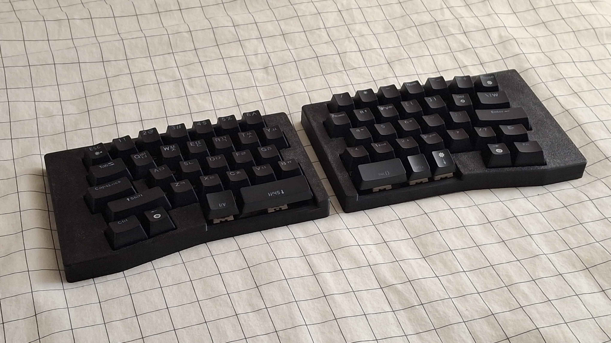
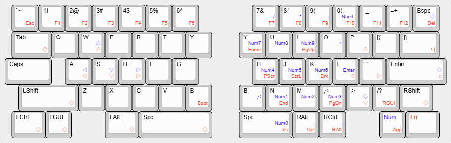
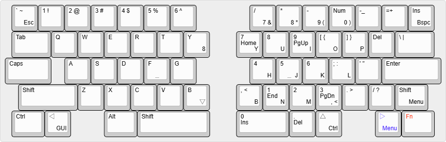

# DASIC

(pronounced like DAH-sick)

60-64 key symmetrical row stagger alice style wired split keyboard

The name "dasic"(dasik) is korean traditional dessert, and also is korean pun of [ansic](https://github.com/yuburoll/ANSIC) with many key.

## Preparation

- 2x pro micro form factor dev board

- 2x dasic PCB Boards, provided from the repo

- 1x printed case sets, 2 parts total, provided from the repo

- 2x 1.5-1.6T keyboard plates, provided from the repo

- 2x 1.5-1.6T back plates, provided from the repo

- 0-2x 0.5u blocker, provided from the repo, normally 1

- 64x diodes

- 24-30x M2x6 screws, flathead

- 2x PJ320A 1/8(3.5mm) TRRS connector

- 2x 4x4x1.5mm surface mount tact switches

- 1x 1/8(3.5mm) TRRS cable

- 2-6x PCB Mounted 2u Keyboard Stabilizers, normally 4 

- 60-64x MX Keyswitches, normally 62

- A set of Keycaps

## Build Guides

work in progress. sorry!

there's some notices before the build:

- **You may flash the firmware before soldering the dev board.**

- Assemble dev board with 2.5mm height pin headers on front side, assume that components side are faced down.

- Jump every jumpers on back side.

- You may use mill-max styled socket to make the keyswitches hot-swappable.

## Default Keymap

There are two more layers - Num, Fn - which can be noticed by the color legends. ◇ Means Transparent; which uses base keymap.

Holding the color legend key swaps the layer.

You may refer to the picture below for the keycap layout:

## Licenses

all codes follow MIT license.

all designs and the hardware board follow CC BY-SA 4.0 license.

If you want to make a commercial product, it would be appreciated if you sponsor some bucks for me.

