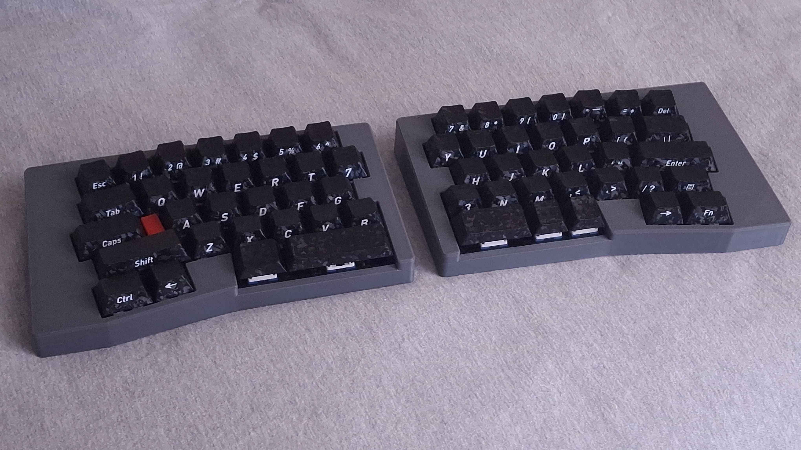
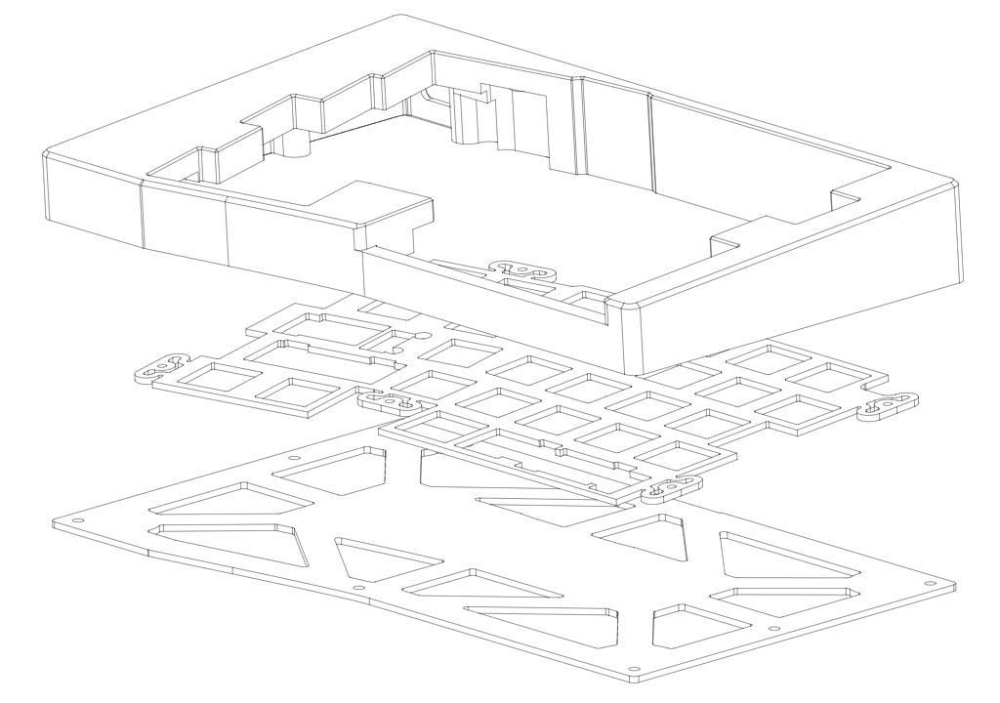
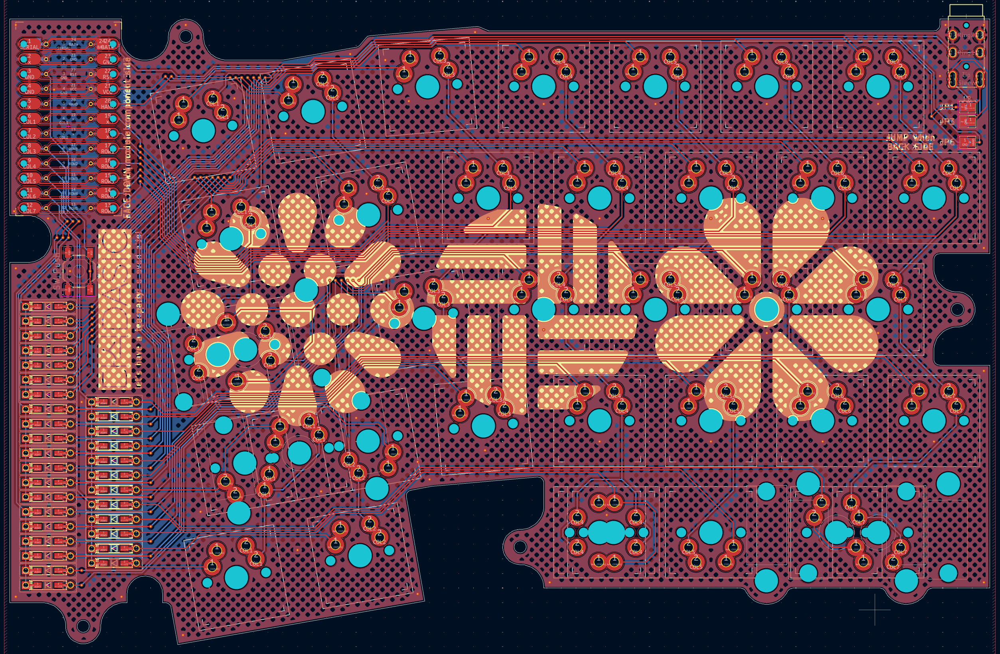

# DASIC

(pronounced like DAH-sick)

60-64 key symmetrical row stagger alice style wired split keyboard

The name "dasic"(dasik) is korean traditional dessert, and also is korean pun of [ansic](https://github.com/yuburoll/ANSIC) with many key.

[V2 README](V2/README.md)
[V1 README(deprecated since May 22, 2026)](V1/README.md)

# DASIC 다식

60-64 좌우대칭 앨리스 배열 스플릿 키보드

키 수 많은 [안식](https://github.com/yuburoll/ANSIC)이라는 농담을 치고 싶었습니다.

[V2 README](V2/README_ko.md)
[V1 README(2026년 3월 22일부터 지원 종료)](V1/README_ko.md)

## Licenses

all codes follow MIT license.

all designs and the hardware board follow CC BY-SA 4.0 license.

If you want to make a commercial product, it would be appreciated if you sponsor some bucks for me.

## 라이센스

모든 코드는 MIT license를 따릅니다.

모든 디자인과 하드웨어 보드는 CC BY-SA 4.0 license를 따릅니다.

본 디자인을 가지고 상업활동을 하고 싶으시다면, 몇 푼 정도 후원해주시면 감사하겠습니다...

