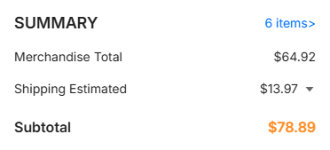
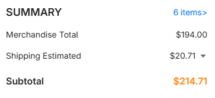
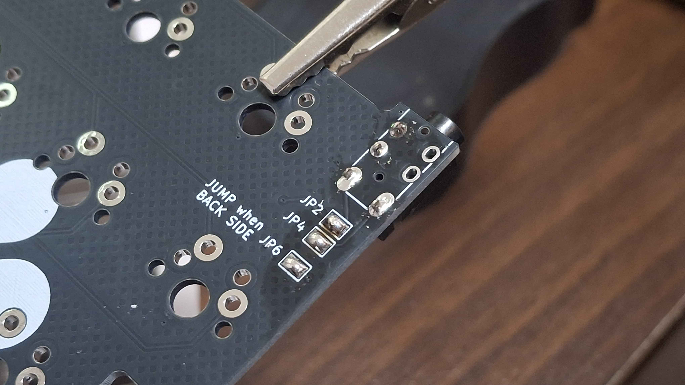

# 빌드 가이드

DASIC의 빌드 가이드입니다.

**이 빌드가이드의 사진은 V1 기준이며, V2를 위한 빌드가이드는 제작중입니다. 지문이 더 정확하니, 지문을 우선시하여 읽어주세요.**

### 추가 자료

[**준비물과 구매처 가이드**](preparation_ko.md)

[**납땜 팁**](solderingTip_ko.md)

### 제조 예상 가격

한 세트만 빌드할 때:

다섯 세트를 빌드할 때:

빌드시 제일 개당 단가가 적은 건 다섯 세트(약 45달러)지만, 두 세트만 빌드해도 개당 제조 단가를 55달러 가량으로 가져갈 수 있습니다.

## 컨트롤러 보드에 펌웨어 올리기

rp2040 보드를 사용할 때를 상정했습니다.

컨트롤러 보드의 Boot 버튼을 누르며 usb를 연결하면 이동식 디스크가 하나 뜹니다. (이를 dfu모드라고 합니다.)

[uf2examples 폴더](../firmware/nologoRP2040qmk/examples) 안에 있는 .uf2 파일을 해당 이동식 디스크에 집어넣으면 펌웨어가 들어갑니다. vial 펌웨어를 올리시는 걸 추천드립니다.

펌웨어에는 [qmk](https://qmk.fm/)를 사용하고 있습니다. 펌웨어를 직접 만들고 싶다면 "firmware/qmk" 경로 내의 "modubu" 폴더를 "qmk_firmware\keyboards" 경로로 붙여넣어 qmk msys를 이용해 빌드하면 됩니다.

완전히 조립된 이후 펌웨어를 올리려면 버튼을 누를 수 없어 문제가 생깁니다. 그래서 **컨트롤러 보드를 납땜하기 전에 펌웨어를 올리시는 걸 추천합니다**.

펌웨어를 올린 이후 dfu 모드에 들어갈 땐 몸으로부터 가장 바깥쪽 최하단의 스위치(ctrl, fn 위치)를 누른 채 키보드를 연결하면 됩니다.

## 컨트롤러 보드 납땜하기

우선 컨트롤러 보드와 동봉되는 헤더핀의 한 줄을 뗍니다. usb와 제일 가까운 헤더 핀 부분은 납땜하지 않기 때문입니다.

**프로세서 부품이 아래로 향하게, usb와 제일 가까운 핀 부분은 비워둔 채로** 헤더 핀을 끼워 납땜합니다.

빵판이 있다면 위와 같이 빵판에 헤더 핀을 안착시키면 편하게 납땜할 수 있습니다.

방금전에 납땜한 프로세서 보드를 pcb에 납땜합니다.

**프로세서 보드를 올린 면이 pcb의 뒷면이 되고, 반대편 면은 앞면이 됩니다. 왼손과 오른손에 맞춰 pcb를 뒤집어 프로세서 보드를 올려주세요.**

**주의사항: 이 사진은 V1 기판입니다. V2에선 헤더 핀의 풋프린트가 다르게 생겼습니다.**

pcb의 앞면을 보고 헤더 핀이 앞면 패드에 연결되도록 모두 땜합니다.

실제 V2의 풋프린트는 다음과 같이 생겼습니다. 중간 구멍에 tht가 없으며, 위아래로 패드가 있는 구조입니다. 패드와 핀을 납을 충분히 많이 올려 연결해주시기 바랍니다.

## 커넥터 납땜하기 & 점프하기

각 손의 뒷면 부분에 커넥터가 오도록 TRRS 커넥터를 배치하고, 앞면에서 납땜합니다. 납땜할 때 마스킹 테이프 등으로 고정해두면 좋습니다.

뒷면을 보고 있는 상태에서, "JUMP when BACK SIDE"라는 문구 주변의 점퍼 세 점을 땜납으로 점프합니다. 반대쪽 면(=커넥터가 올라가 있지 않는 앞면)은 하지 않습니다.

점퍼를 땜할 땐 먼저 인두기 팁에 솔더페이스트를 잔뜩 묻히고 거기에 납을 방울지게 올린 뒤, 이 상태로 방울을 점퍼에 가져다 댄 다음 두 점퍼가 서로 이어졌다 싶을 때 뗍니다.

- 점퍼가 서로 이어졌지만 납이 날카롭고 뾰족하게 올라온다면 솔더 페이스트를 팁에 더 묻혀주세요.

- 점퍼가 서로 안 붙고 패드에 방울만 진다면, 납을 팁에 더 올려주세요.

- 점퍼가 서로 이어지면서 딱 유선형으로 방울지게 올라오게 되었을 때가 성공입니다. 다음 점퍼를 땜하면 됩니다.

잘 안되면 점퍼 부분을 잠시 식혔다가, 충분한 양의 플럭스를 팁과 점퍼에 묻히고 다시 시도해보세요.

## 다이오드 납땜하기

THT 다이오드를 사용한다면, 위의 사진과 같이 다이오드의 다리를 ㄷ자로 미리 굽혀서 준비합니다.

우선 갯수가 더 많은 열 쪽의 다이오드를 먼저 땜합니다. 앞면인지 뒷면인지는 상관없으며, **모든 다이오드 방향이 바깥쪽을 향해야 합니다.**

납땜을 마치면 다이오드의 뻗어난 잔가지 다리부분을 니퍼로 모두 자릅니다. 주변 패드에 닿지 않게 바짝 당겨서 잘라둡니다. 자를 땐 튕겨나가지 않도록 꼭 다리를 손가락으로 잡고 자릅시다.

처음 열을 마치면 다음 열도 똑같은 순서대로 땜합니다. **다이오드의 다리 부분이 서로 부딪히지 않도록 조심해 주세요.**

SMD 다이오드를 사용할 땐 다이오드 위치의 한 쪽 패드에 납을 묻히고, 납을 묻힌 패드에 열을 다시 가합니다.

패드의 납이 녹았을 때 SMD 다이오드의 한 쪽 다리를 가져다 위치를 정렬해 붙힌 뒤, 반대쪽 다리를 땜합니다.

## (선택) SMD 스위치 납땜하기

smd 스위치는 reset 핀과 연결되어있습니다. rp2040이 아닌 프로세서 보드는 이 스위치로 dfu 모드에 들어가게 됩니다. 이 스위치는 뒷면에 붙여주세요.

붙이는 방식은 SMD 다이오드와 동일합니다. 스위치 위치의 한 쪽 패드에 납을 묻히고, 납을 묻힌 패드에 열을 다시 가합니다.

패드의 납이 녹았을 때 스위치의 한 쪽 다리를 가져다 위치를 정렬해 붙힌 뒤, 나머지 다리를 땜합니다.

## (선택) 밀맥스 납땜하기

위의 사진과 같이, 밀맥스를 앞면에서 집어넣고 마스킹 테이프 등으로 고정한 뒤 납땜합니다.

밀맥스를 집어넣는 위치는 앞면 기준 패드가 보이지 않는 구멍, 뒷면 기준 패드가 보이는 쪽의 정 중앙입니다.

Caps & Enter 부분의 밀맥스는 사진을 참고하며 주의해 고정합니다.

앞면 기준에서는 중앙이 아닌 쪽으로 정렬해야 하며, 뒷면으로 볼 땐 패드 모양의 중앙에 정렬되어있어야 합니다.

## 스태빌라이저 조립하기

2u 이상의 키캡이 설치되는 부분에 전부 스태빌라이저를 채결해줍니다.

기본적으로 왼쪽 shift, 스페이스바 부분 두 곳, 엔터 총 4곳에 채결하게 됩니다.

## 조립상태 확인하기

납땜 위치와 상태를 확인하며 조립이 제대로 됐는지 확인합니다. 다이오드가 올라가 있는 면은 방향만 맞다면 상관 없습니다.

## 스위치와 보강판 조립하기

키보드 보강판에 미리 스위치와 블로커를 체결합니다. 사진엔 키캡도 체결되어있으나, 키캡까지 체결할 필요는 없습니다.

블로커를 채결할 땐 위의 사진처럼 나사를 조여 채결합니다. halfScrew 버전을 쓴다면 튀어나온 한 쪽은 보강판에 걸친 뒤 나머지 한 쪽을 나사로 고정합니다.

**주의사항: 이 사진은 V1 기판입니다. V2에선 개발보드와 trrs 잭을 뒷면(사진의 반대편)에 올려두어야 합니다**

이 위에 사진처럼 조립한 보드를 얹고, 스위치를 납땜합니다.

## 케이스 조립하기

**주의사항: 이 사진은 V1 기판입니다. V2에선 개발보드와 trrs 잭을 뒷면(사진의 반대편)에 올려두어야 합니다**

보강판과 pcb의 조립체를 케이스에 집어넣습니다.

사진과 같이 TRRS 소켓부터 먼저 위치를 잡을 수 있도록 기울여 집어넣습니다.

**주의사항: 이 사진은 V1 기판입니다. V2에선 개발보드와 trrs 잭을 뒷면(사진의 반대편)에 올려두어야 합니다**

케이스에 조립체를 집어넣으면 다음과 같은 모양이 됩니다.

- 보강판만 나사를 채결하면 부드러운 타건감을 얻을 수 있습니다. 고정하는 곳은 키보드 한 쪽당 총 5곳입니다.

- pcb까지 나사를 채결하면 좀 더 단단한 타건감을 얻을 수 있습니다. 추가로 고정할 곳은 키보드 한 쪽당 총 4곳입니다.

나사를 채결하면 백플레이트를 덮어 케이스와 채결합니다. 고정하는 곳은 키보드 한 쪽당 7곳입니다.

마지막으로 각 백플레이트의 범폰 위치에 범폰 4조각을 붙이면 완성입니다.
