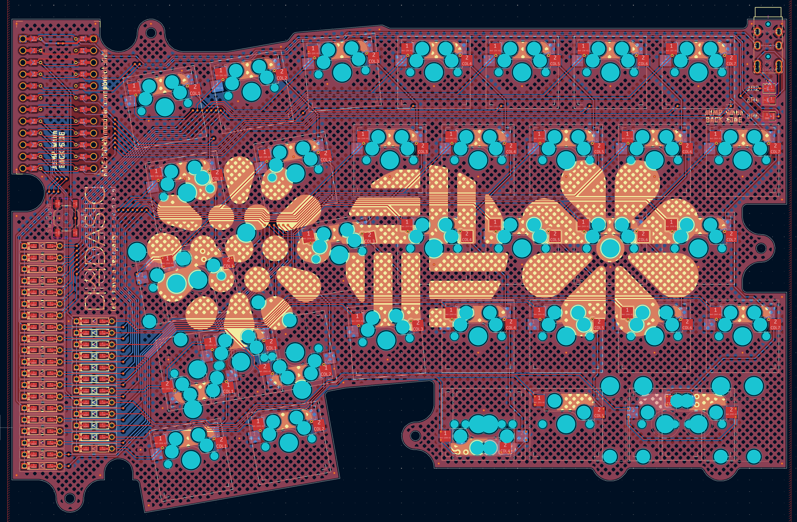

# DASIC hotswap version

this folder is for hotswap version of dasic.

### Notice

- This version uses different PCB and keyboard plate layout. you may fabricate these from this folder.

- This version uses same case, same backplate, same blocker, same firmware. you may fabricate these from the master folder.

- This version can use kailh hot swap socket or such.

- This version can split/merge 2.25u shift position.

- This version cannot change thumb layout to other one. this forces left hand to 1.25u/2.75u layout and right hand to 2u/1u/1u layout.

- This version cannot change Caps/Enter keycap to another sized one.

- Be careful when soldering hot swap socket for space bar positions - they will be soldered by small pad pieces, so you may solder these more tightly.

